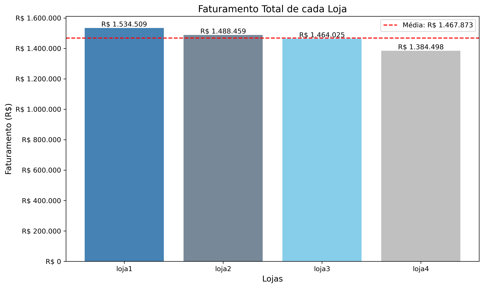
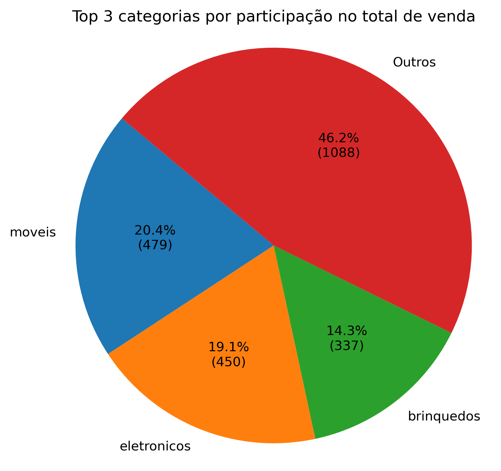
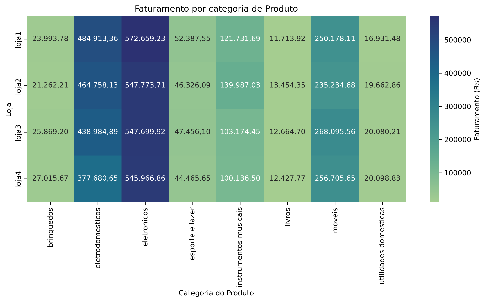
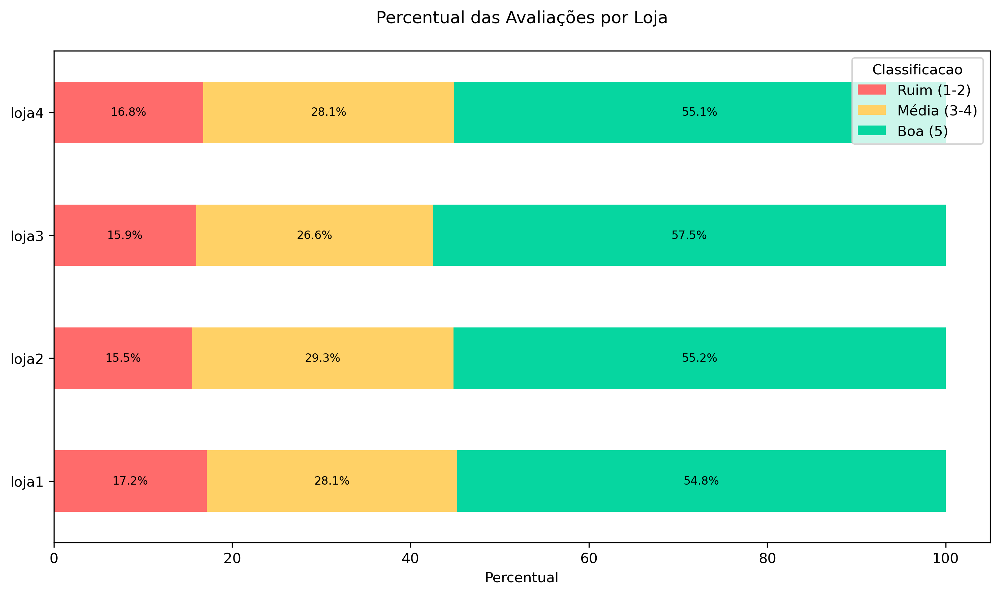
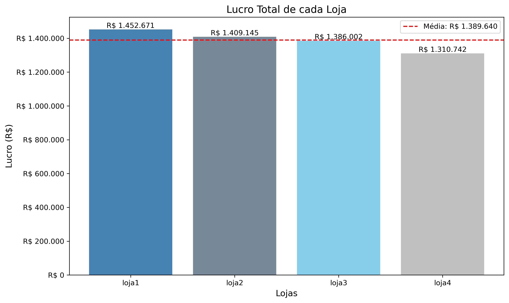

# 📊 Projeto de Data Science — Análise de Desempenho de Lojas (Alura Store)

## 📌 Sobre o Projeto

Este é um projeto de **análise de dados**, desenvolvido como parte de um **desafio da formação em Data Science** da escola **Alura**. O objetivo é auxiliar o Sr. João, proprietário de uma franquia com 4 lojas, a decidir **qual loja deve ser encerrada** para que ele possa investir em outro segmento.

A análise se baseia em mais de **3 anos de dados históricos**, utilizando critérios como:

- Faturamento total por loja
- Satisfação dos clientes (avaliações)
- Logística (frete médio)
- Popularidade e rentabilidade dos produtos por categoria

---

## 🛠️ Tecnologias e Bibliotecas Utilizadas

- **Python 3.12**
- **Pandas** – Manipulação e análise de dados
- **Matplotlib** – Visualização gráfica
- **Seaborn** – Visualizações estatísticas avançadas

---

## 🔍 Etapas da Análise

### 1. 📈 Faturamento Total por Loja
- A Loja 4 apresentou o menor faturamento: R$ 1.384.497,58.
- A Loja 1 foi a mais lucrativa: R$ 1.534.509,12.

---

### 2. 🛒 Categorias Mais Vendidas
- As categorias com maior volume de vendas:

-- **Móveis** – 20,4%

-- **Eletrônicos** – 19,4%

-- **Brinquedos** – 14,3%

---

### 3. 💰 Faturamento por Categoria
- Quando o critério é faturamento, o cenário muda:

-- **Eletrônicos** são os mais lucrativos.

-- Seguidos por **Eletrodomésticos** e **Móveis**.

Apesar de liderarem em quantidade de vendas, os **Móveis** possuem um ticket médio inferior.

---

### 4. ⭐ Avaliações dos Clientes
- As médias de avaliação são muito próximas:
-- Loja 1 tem a pior média: 3.98, com 17,2% de avaliações entre 1 e 2 estrelas.
-- Loja 4 tem média 4.00, com 16,8% de avaliações ruins.

  

---

### 5. 🚚 Frete Médio e Lucro Final

| Loja   | Frete Médio (R$) |
|--------|------------------|
| Loja 1 | 34,69            |
| Loja 2 | 32,17            |
| Loja 3 | 33,44            |
| Loja 4 | 31,28            |

#### 📦 Frete Médio
- **Loja 4** tem o frete mais barato: **R$ 31,28**
- **Loja 1** tem o frete mais caro: **R$ 34,69**

#### 💰 Lucro Final (Faturamento – Frete)
- **Loja 1** lidera com: **R$ 1.452.671,15**
- **Loja 4** tem o pior resultado: **R$ 1.310.741,70**

➡️ Ou seja, **mesmo com o menor frete**, a **Loja 4** não transforma isso em vantagem competitiva.

---

## 📌 Conclusão: A Loja a Ser Vendida Deve Ser a **Loja 4**

✅ Apresenta **o menor faturamento** e **o menor lucro**  
✅ Segunda pior em **avaliação dos clientes**  
✅ Só se destaca em volume de vendas de uma categoria menos lucrativa  
✅ Tem o pior desempenho nas categorias mais rentáveis (Eletrônicos e Eletrodomésticos)

---

## 👤 Autor

**Bruno Ferrer**  
📎 [LinkedIn]([https://www.linkedin.com/in/bruno-ferrer-49566230/])

---
